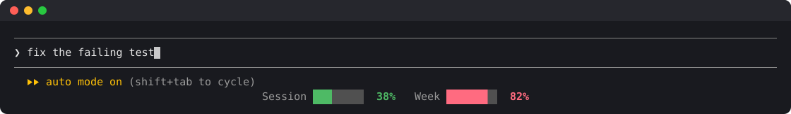

# limits-meter

A Claude Code mod that shows your usage limits for the current session (5 h) and the week as small progress bars with a percentage. They sit on a centred row at the bottom of the screen, under the prompt's hint line.



Each bar is green below 50 %, yellow from 50 % and red from 80 %, in your theme's colours. The screenshot is the mod running in a 120-column terminal with sample readings.

## Install

Type this at the prompt of a Claude Code terminal session:

```
/plugin install limits-meter --marketplace marcelmatula/limits-meter
```

Answer `y` to add the marketplace, then pick a scope (user scope loads it in every session). The mod is active in that session at once; the meters show as soon as it has a reading, at the latest after the next response.

Or in two steps:

```
/plugin marketplace add marcelmatula/limits-meter
/plugin install limits-meter@marcel-mods
```

## What to expect

- The figures are the ones Claude Code receives with each response, so the mod makes no requests of its own. They update whenever a window moves by a whole point.
- On a Claude subscription only: with an API key there are no rate-limit windows to show. In a new session the row appears after the first response.
- It adds one line at the bottom. While Claude Code shows a notice on the hint line (for example "Context left until auto-compact"), the notice moves to its own line under the meters.
- On a narrow terminal the labels shorten to `5h` and `7d` and the bars get shorter. Below about 20 columns the row is hidden.

## How it works

`hooks/register.tsx` is a plugin of function hooks:

- `session.start` reads the current windows with `$.session.usage()`.
- `session.measure` keeps them up to date as responses arrive.
- A `ui.render` hook on the `PromptHint` site draws Claude Code's own hint line unchanged and adds the meter row below it.

Built and tested on Claude Code 2.1.294. The function-hooks plugin API is early access and may change between releases.

## Development

```
claude plugin validate .
claude plugin test .
claude --plugin-dir .
```

## License

MIT. See [LICENSE](LICENSE).
