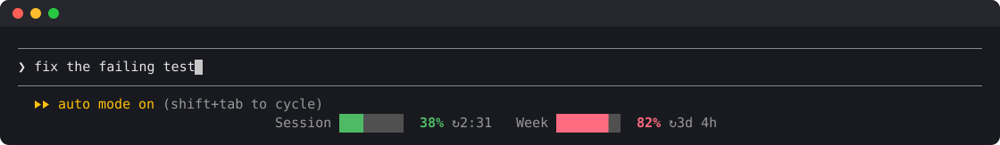

# limits-meter

A Claude Code mod that shows your usage limits for the current session (5 h) and the week as small progress bars with a percentage. They sit on a centred row at the bottom of the screen, under the prompt's hint line. `/limits` hides or shows them, and the choice is remembered.

Part of [claude-mods](../README.md), Marcel's Claude Code marketplace (`marcel-mods`).



Each bar is green below 50 %, yellow from 50 % and red from 80 %, in your theme's colours. The screenshot is the mod running in a 120-column terminal with sample readings.

## Install

Type this at the prompt of a Claude Code terminal session:

```
/plugin install limits-meter --marketplace marcelmatula/claude-mods
```

Answer `y` to add the marketplace, then pick a scope (user scope loads it in every session). The mod is active in that session at once; the meters show as soon as it has a reading, at the latest after the next response.

Or in two steps:

```
/plugin marketplace add marcelmatula/claude-mods
/plugin install limits-meter@marcel-mods
```

## Showing and hiding

| Type | What happens |
| --- | --- |
| `/limits` | hides the meter row if it's showing, shows it if it's hidden |
| `/limits off` | hides it |
| `/limits on` | shows it |

Claude Code's own hint line stays as it is either way. The choice is remembered across sessions, so a hidden meter stays hidden until you turn it back on.

## What to expect

- The figures are the ones Claude Code receives with each response, so the mod makes no requests of its own. They update whenever a window moves by a whole point.
- On a Claude subscription only: with an API key there are no rate-limit windows to show. In a new session the row appears after the first response.
- It adds one line at the bottom. While Claude Code shows a notice on the hint line (for example "Context left until auto-compact"), the notice moves to its own line under the meters.
- On a narrow terminal the labels shorten to `5h` and `7d` and the bars get shorter. Below about 20 columns the row is hidden.

## What it can access

A mod runs inside Claude Code's plugin sandbox and can reach the outside only through `$` calls. On Claude Code 2.1.294 the sandbox has no `fetch`, `require`, `process` or `eval`, and the validator refuses disguised `$` access, so its list of hooks and calls covers everything a mod can do. For limits-meter that list is:

| Hooks | When they run |
| --- | --- |
| `session.start` | once when a session starts |
| `session.measure` | when Claude Code's usage figures change |
| `ui.render` on `PromptHint` | when the line under the prompt is drawn |
| `command.run` on `limits` | when you run `/limits` |

| `$` calls | What for |
| --- | --- |
| `$.session.usage` | reads the rate-limit figures |
| `$.state.get`, `$.state.set` | keeps those figures for the session, in the mod's own state |
| `$.ui.resolve` | gets the elements it draws with |
| `$.command.register` | adds the `/limits` command |
| `$.store.get`, `$.store.set` | keeps the shown or hidden choice between sessions |

Its one saved setting, shown or hidden, lives in the mod's own small store, which Claude Code keeps in your Claude Code configuration folder. Beyond that it reads and writes no files, runs no shell commands and makes no network requests. It has no hooks on your prompts or on Claude's tool calls; its one command hook answers `/limits`.

Check this yourself from a clone of the repo, in the `hooks:` and `calls:` lines:

```
claude plugin validate limits-meter
```

[`capabilities.json`](capabilities.json) holds the same list. CI fails if the mod's hooks or `$` calls ever go beyond it, so any new kind of access has to show up as a change to that file.

## How it works

`hooks/register.tsx` is a plugin of function hooks:

- `session.start` reads the current windows with `$.session.usage()`.
- `session.measure` keeps them up to date as responses arrive.
- A `ui.render` hook on the `PromptHint` site draws Claude Code's own hint line unchanged and adds the meter row below it, unless the meter is hidden.
- `/limits` is registered in `session.start` and answered by a `command.run` hook. It flips the hidden setting in the session's state, which redraws the row at once, and saves it with `$.store`. The next `session.start` reads it back.

Built and tested on Claude Code 2.1.294. The function-hooks plugin API is early access and may change between releases.

## Development

From this folder:

```
claude plugin validate .
claude plugin test .
claude --plugin-dir .
```

## License

MIT. See [LICENSE](LICENSE).
